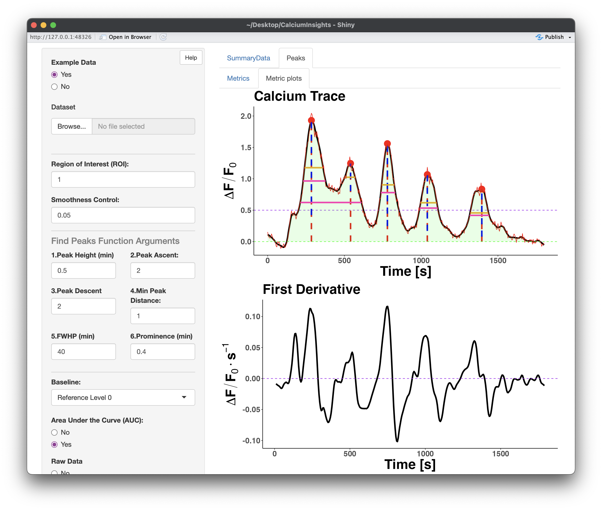

# CalciumInsights

CalciumInsights is an interactive application built in R designed to analyze tissue-agnostic calcium traces.




# Installation

To install CalciumInsights R and RStudio are required:

<https://cran.r-project.org/>

<https://posit.co/download/rstudio-desktop/>

## Packages

```{r}
config (>= 0.3.1)
golem (>= 0.3.2)
shiny (>= 1.7.2)
shinydashboard
shinyjs
ggplot2
DT
gridExtra
mdatools
pracma
tidyverse
dplyr
reshape2
refund
fda
fds
reshape2
latex2exp
plotly
magrittr
png
prospectr
```

## How to install the app

### Only the first time the app is installed, enter the following command in the console
```
install.packages("remotes")
```
### The following console command is to install from github
```
remotes::install_github("AOG-Lab/CalciumInsights")
```
## Example

This is a basic example which shows you how to solve a common problem:

``` r
library(CalciumInsights)
run_app()
```
